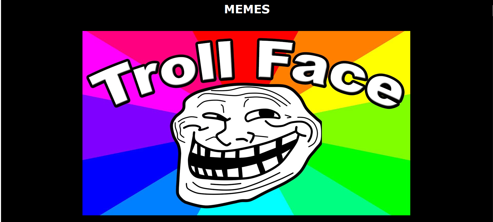
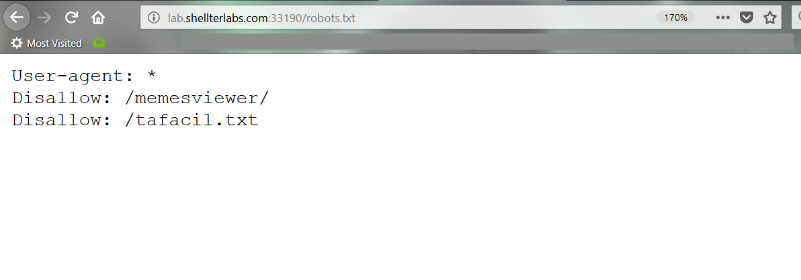

# Memes
Ao abrir o desafio, encontramos a seguinte página:

Olhando o arquivo /robots.txt, lembrando que é usado para controlar buscadores (como o google) para esconder determinadas páginas
Encontramos uma página "/tafacil.txt" e um "/memesviewer/".  

Abrindo o /tafacil.txt percebemos algo interessante... Tente você mesmo :D  

Então, seguindo no desafio, abrimos a página /memesviewer/ e encontramos uma lista de diretórios.  
Dentre eles um arquivo `flag.txt`, o qual abrimos e encontramos a flag.
