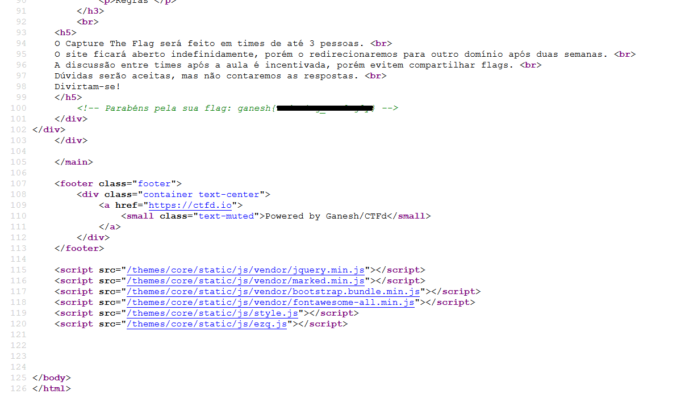

# Mighty Searcher
O intuito desse challenge era fazer os participantes buscarem a flag escondida no site.  
Abrindo o código fonte da página percebemos que na verdade que ela é redirecionada.  
Então, indo para esse domínio e abrindo a página de Regras (ou /rules), encontramos, no código fonte, um comentário na linha 100:

